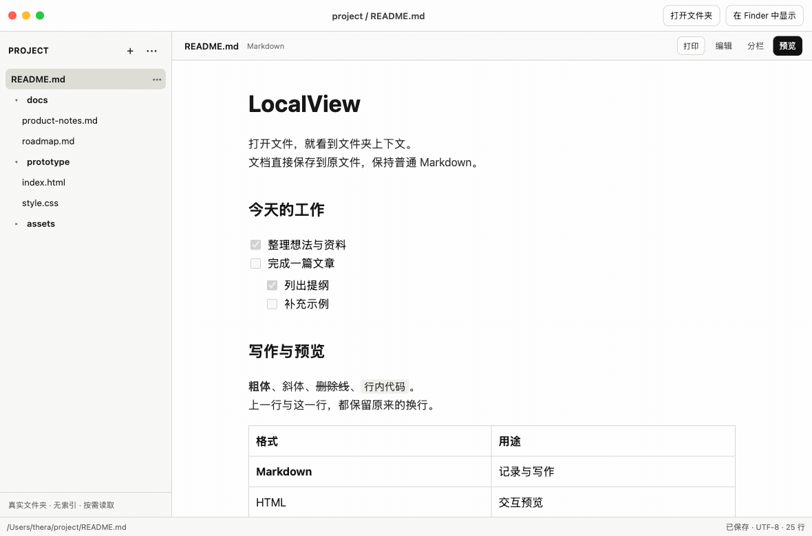

# LocalView

**Open a file, see the folder context.**

A lightweight, macOS-first workspace for local documents. Browse real folders, edit Markdown in place, preview HTML and spreadsheets, and compare folders in independent windows.

No import step. No vault. No mandatory indexing. Your files stay ordinary files.

[简体中文](README.zh-CN.md) · [Download Beta](https://github.com/theradengai/localview/releases/tag/v0.2.0-beta.5) · [Report a bug](https://github.com/theradengai/localview/issues/new/choose) · [MIT license](LICENSE)



*Browser demo with synthetic documents: switch between Preview, Split and Edit, update a task, and open HTML. Real filesystem operations are available in the macOS app. [Static screenshot](docs/images/localview-demo.png).*

## What you can do

- **Use Markdown as an interactive Kanban board.** Create a board from a folder’s `+` menu. Drag cards and columns, edit in the right-hand details panel, and switch to Split to see the same `.md` source. Board and source share undo and auto-save. [Format and limits](docs/KANBAN.md).

- **Start with a file or folder.** Open a supported file from Finder and see its folder context. Expand directories on demand.
- **Work directly in Markdown.** Preview by default, source-preserving Live Preview when editing, or a left-preview/right-source split. Format selected text and edit supported tables cell by cell.
- **Check off tasks in Preview.** Toggle tasks in Preview, Split or Edit with auto-save and undo. Pasted task lists with deep indentation also render while the original spacing and line endings are preserved.
- **Preview more formats.** Sandboxed interactive HTML, images, PDFs, CSV, Excel, ODS, and system-provided Office/iWork previews.
- **Organize in the folder.** Create Markdown files and folders, rename inline, select files/folders with `⌘` or `Shift`, drag the selected group between folders, and move the group to macOS Trash with one confirmation. See [selection controls and safety](docs/FOLDER_SELECTION.md).
- **Keep changes safe.** 600 ms idle auto-save, `⌘S` to save immediately, and conflict detection when another application edits the same file.
- **Paste screenshots.** In Markdown Edit or Split, `⌘V` saves clipboard images beside the document in `assets/` and inserts relative image references (PNG/JPEG/GIF/WebP, up to 8 images and 10 MB per paste).
- **Compare side by side.** `⌘N` opens an independent workspace window. `⌘P` opens native print settings for rendered Markdown.

## Download

**0.2.0-beta.5 · macOS Monterey 12 or later.** This is a prerelease, not a stable release. The app interface is currently primarily Simplified Chinese. Windows and Linux builds are not supported in this Beta.

| Your Mac | Installer |
| --- | --- |
| Apple Silicon — M-series chip | [Apple Silicon DMG](https://github.com/theradengai/localview/releases/download/v0.2.0-beta.5/LocalView_0.2.0-beta.5_aarch64.dmg) |
| Intel — including Intel MacBook Air | [Intel DMG](https://github.com/theradengai/localview/releases/download/v0.2.0-beta.5/LocalView_0.2.0-beta.5_x64.dmg) |

Quit an older LocalView, open the DMG, drag **LocalView** into **Applications**, then eject the disk image. Launch the installed copy.

These are **ad-hoc-signed, non-notarized Beta builds**. macOS may block the first launch. Read the [installation and verification guide](docs/INSTALL.md) before installing. Intel/Monterey compatibility still benefits from testing on real Intel hardware; cross-compilation does not prove every OS-specific interaction.

## Format support

| Format | Experience |
| --- | --- |
| Markdown | Edit, Live Preview, Split, Preview with task checkboxes, rendered printing |
| HTML | Source, Split, sandboxed interactive Preview with local resources |
| Plain text / common code files | Text editing and auto-save |
| Images / PDF | Preview |
| CSV / XLS / XLSX / ODS | Read-only grid, wrapped cells, sheet navigation for workbooks |
| Numbers / Pages / Keynote / Word / PowerPoint | macOS Quick Look preview; availability and page controls depend on the installed provider |

CSV requires UTF-8 (BOM accepted) and comma-separated values; leading zeros are preserved as text. Office editing, formula recalculation, macros, charts, and complete Office formatting fidelity are not implemented. Some complex Markdown tables fall back to source editing. Printing is currently Markdown-only.

See the [feature reference and limitations](docs/FEATURES.md) for details.

Markdown reading and printing preserve ordinary line breaks. Edit, Split and Preview retain undo history when switching modes; inactive table cells render inline formatting. See the [format regression sample](docs/fixtures/markdown-format-matrix.md) and [validation report](docs/MARKDOWN_FORMAT_VALIDATION.md).

## Develop locally

Use Node.js 24 LTS, Rust 1.91.1 or later, and Xcode Command Line Tools on macOS.

```bash
git clone https://github.com/theradengai/localview.git
cd localview
npm ci
npm run tauri:dev
```

For the in-memory browser demo, run `npm run dev`. The browser demo never writes to your real folders.

```bash
npm test
npm run build
cargo fmt --check --manifest-path src-tauri/Cargo.toml
cargo check --locked --manifest-path src-tauri/Cargo.toml
cargo test --locked --manifest-path src-tauri/Cargo.toml
```

Build instructions, architecture-specific packaging, and the release process are in [CONTRIBUTING.md](CONTRIBUTING.md).

Built with **Tauri 2 · React · TypeScript · CodeMirror 6 · Rust**. The [prototype](prototype/local-folder-viewer-prototype.html) defines the visual language; [MVP.md](docs/MVP.md) describes the architecture and product constraints.

## Contribute

Small, focused contributions and reproducible bug reports are welcome. Start with [CONTRIBUTING.md](CONTRIBUTING.md). For security vulnerabilities, follow [SECURITY.md](SECURITY.md) instead of posting private documents or credentials in a public issue.

Near-term priorities: reliable file operations, smoother Markdown/table editing, compatibility testing on both Mac architectures, and simpler installation. See [release notes](CHANGELOG.md) for shipped changes.

## License

LocalView's original source is available under the [MIT License](LICENSE). Third-party components retain their own licenses; their notices and source links are collected in [THIRD_PARTY_NOTICES.md](THIRD_PARTY_NOTICES.md) and included in the app bundle.
