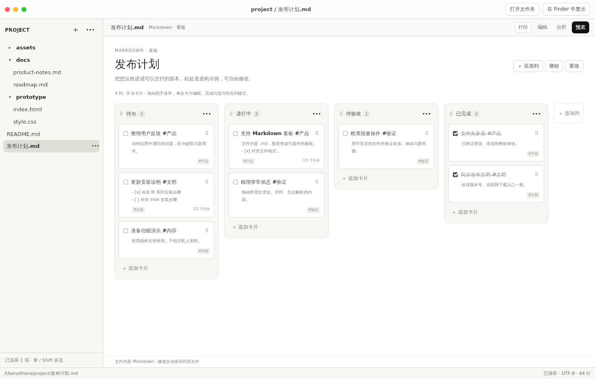

# LocalView

**Open local files directly. Preview and edit in place.**

A lightweight document workspace for **macOS and Windows**. Open a file or folder directly, browse its real directory tree, preview different formats, and edit Markdown, HTML or text in place.

**No indexing. No import step.** Your files stay ordinary files, in their original folders.

[简体中文](README.zh-CN.md) · [Windows Beta](https://github.com/theradengai/localview/releases/tag/v0.2.0-beta.7) · [macOS Beta](https://github.com/theradengai/localview/releases/tag/v0.2.0-beta.6) · [Report a bug](https://github.com/theradengai/localview/issues/new/choose) · [MIT license](LICENSE)


*Browser demo with synthetic documents: switch between Preview, Split and Edit, update a task, and open HTML. Real filesystem operations are available in the desktop apps. [Static screenshot](docs/images/localview-demo.png).*

## What you can do

- **Use Markdown as an interactive Kanban board.** Create a board from a folder’s `+` menu. Drag cards and columns, edit in the right-hand details panel, and switch to Split to see the same `.md` source. Board and source share undo and auto-save. [Format and limits](docs/KANBAN.md).
- **Start with a file or folder.** Choose **Open file** or **Open folder** to see its folder context; on Windows, `Ctrl+O` opens a file. Finder integration remains available on macOS. Expand directories on demand.
- **Work directly in Markdown.** Preview by default, source-preserving Live Preview when editing, or a left-preview/right-source split. Format selected text and edit supported tables cell by cell.
- **Check off tasks in Preview.** Toggle tasks in Preview, Split or Edit with auto-save and undo. Pasted task lists with deep indentation also render while the original spacing and line endings are preserved.
- **Preview more formats.** Sandboxed interactive HTML, images, PDFs, CSV, Excel and ODS. Office/iWork uses Quick Look on macOS; Windows offers an **Open in default app** action instead of an embedded Office preview.
- **Organize in the folder.** Create Markdown files and folders, rename inline, select files/folders with `⌘`/`Ctrl` or `Shift`, drag the selected group between folders, and move the group to macOS Trash or the Windows Recycle Bin with one confirmation. See [selection controls and safety](docs/FOLDER_SELECTION.md).
- **Keep changes safe.** 600 ms idle auto-save, `⌘S` / `Ctrl+S` to save immediately, and conflict detection when another application edits the same file.
- **Paste screenshots.** In Markdown Edit or Split, `⌘V` / `Ctrl+V` saves clipboard images beside the document in `assets/` and inserts relative image references (PNG/JPEG/GIF/WebP, up to 8 images and 10 MB per paste).
- **Compare side by side.** `⌘N` / `Ctrl+N` opens an independent workspace window. `⌘P` / `Ctrl+P` opens print settings for rendered Markdown.

## Interface language

Both desktop platforms offer **System / 简体中文 / English** in the title bar (introduced in macOS Beta 6). Switching is immediate, remembers your selection, and does not translate your documents or reset the editor. [Behavior, system-dialog boundaries and validation](docs/LANGUAGES.md).

## Markdown Kanban

In a folder's `+` menu, choose **新建看板** (New board), or open the [sample Markdown file](docs/fixtures/kanban.md). A `localview: kanban` opening header enables the board: `##` headings are columns, top-level task items are cards, and indented descriptions/subtasks move with each card. Ordinary task lists keep their normal preview.



*Actual Beta 5 production frontend in an isolated WebKit browser, using the repository's synthetic sample. This is not a native macOS acceptance screenshot; browser edits stay in memory.*

[Right-side card details](docs/images/localview-kanban-details.png) · [Board and Markdown in Split](docs/images/localview-kanban-split.png) · [Capture provenance](docs/images/KANBAN_CAPTURES.md) · [Full guide and limits](docs/KANBAN.md)

Drag a card by its handle, or move it with the details panel's column selector. **Preview** is the board; **Edit** is Markdown source; **Split** shows board and source side by side. Moving to a column does not automatically mark a card complete. File-tree multiselection does not imply card multiselection, which is not included. Printing uses the Markdown reading view, not a board image.

## Download

**Windows x64: 0.2.0-beta.7 · macOS: 0.2.0-beta.6.** These are prereleases, not stable releases. Both offer Simplified Chinese and English. Windows targets Windows 10/11 x64 with WebView2 and local drive-letter workspaces. Native ARM64 Windows, UNC/network workspaces and Linux packages are not included. [Windows guide and verification](docs/WINDOWS.md).

**[Windows x64 installer](https://github.com/theradengai/localview/releases/download/v0.2.0-beta.7/LocalView_0.2.0-beta.7_x64-setup.exe)** · [Windows checksums](https://github.com/theradengai/localview/releases/download/v0.2.0-beta.7/SHA256SUMS.txt)

Install for the current user. If WebView2 is missing, the installer downloads its bootstrapper and needs a network connection. The Beta is **unsigned**: Windows may show a publisher/SmartScreen warning. Verify the source and checksum; do not disable system-wide security protection.

The existing macOS release remains unchanged and requires macOS Monterey 12 or later:

| Your Mac | Installer |
| --- | --- |
| Apple Silicon — M-series chip | [Apple Silicon DMG](https://github.com/theradengai/localview/releases/download/v0.2.0-beta.6/LocalView_0.2.0-beta.6_aarch64.dmg) |
| Intel — including Intel MacBook Air | [Intel DMG](https://github.com/theradengai/localview/releases/download/v0.2.0-beta.6/LocalView_0.2.0-beta.6_x64.dmg) |

Quit an older LocalView, open the DMG, drag **LocalView** into **Applications**, then eject the disk image. Launch the installed copy.

These are **ad-hoc-signed, non-notarized Beta builds**. macOS may block the first launch. Read the [installation and verification guide](docs/INSTALL.md) before installing. Intel/Monterey compatibility still benefits from testing on real Intel hardware; cross-compilation does not prove every OS-specific interaction.

## Format support

| Format | Experience |
| --- | --- |
| Markdown | Edit, Live Preview, Split, Preview with task checkboxes, rendered printing |
| Markdown Kanban (`localview: kanban`) | Interactive board, card details and subtasks, card/column sorting; shared source, undo and auto-save |
| HTML | Source, Split, sandboxed interactive Preview with local resources |
| Plain text / common code files | Text editing and auto-save |
| Images / PDF | Preview |
| CSV / XLS / XLSX / ODS | Read-only grid, wrapped cells, sheet navigation for workbooks |
| Numbers / Pages / Keynote / Word / PowerPoint | macOS: Quick Look, depending on the provider. Windows: open in the default application; no embedded Office/iWork renderer |

CSV requires UTF-8 (BOM accepted) and comma-separated values; leading zeros are preserved as text. Office editing, formula recalculation, macros, charts, and complete Office formatting fidelity are not implemented. Some complex Markdown tables fall back to source editing. Printing is currently Markdown-only.

See the [feature reference and limitations](docs/FEATURES.md) for details.

Markdown reading and printing preserve ordinary line breaks. Edit, Split and Preview retain undo history when switching modes; inactive table cells render inline formatting. See the [format regression sample](docs/fixtures/markdown-format-matrix.md) and [validation report](docs/MARKDOWN_FORMAT_VALIDATION.md).

## Develop locally

Use Node.js 24 LTS and Rust 1.91.1 or later. macOS requires Xcode Command Line Tools; Windows requires the MSVC Rust toolchain, C++ Build Tools/Windows SDK and Microsoft WebView2. See [Windows development](docs/WINDOWS.md#development).

```bash
git clone https://github.com/theradengai/localview.git
cd localview
npm ci
npm run tauri:dev
```

For the in-memory browser demo, run `npm run dev`. The browser demo never writes to your real folders.

```bash
npm test
npm run build
cargo fmt --check --manifest-path src-tauri/Cargo.toml
cargo check --locked --manifest-path src-tauri/Cargo.toml
cargo test --locked --manifest-path src-tauri/Cargo.toml
```

Build instructions, architecture-specific packaging, and the release process are in [CONTRIBUTING.md](CONTRIBUTING.md).

Built with **Tauri 2 · React · TypeScript · CodeMirror 6 · Rust**. The [prototype](prototype/local-folder-viewer-prototype.html) defines the visual language; [MVP.md](docs/MVP.md) describes the architecture and product constraints.

## Contribute

Small, focused contributions and reproducible bug reports are welcome. Start with [CONTRIBUTING.md](CONTRIBUTING.md). For security vulnerabilities, follow [SECURITY.md](SECURITY.md) instead of posting private documents or credentials in a public issue.

Near-term priorities: reliable file operations, smoother Markdown/table editing, compatibility testing on both Mac architectures, and simpler installation. See [release notes](CHANGELOG.md) for shipped changes.

## License

LocalView's original source is available under the [MIT License](LICENSE). Third-party components retain their own licenses; their notices and source links are collected in [THIRD_PARTY_NOTICES.md](THIRD_PARTY_NOTICES.md) and included in the app bundle.
